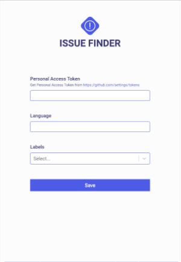

<h1 align="center">Issue Finder</h1>

Chrome extension to view issues with langauge and labels

## Screenshots

  
  
  

## How to use
- Install plugin from chrome web store or download the zip file.
- Login with your github account.
- Add desired language and labels in the options page.

